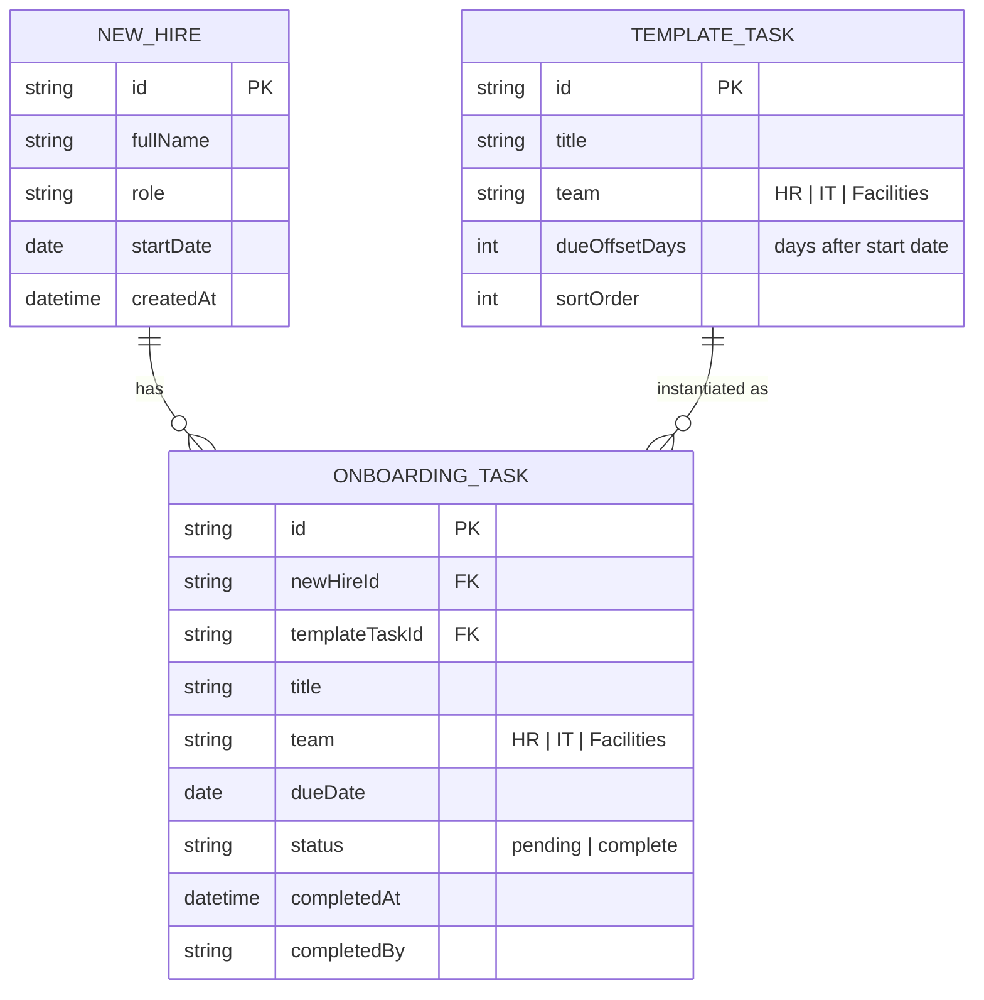

# Domain Model

The tracker centers on a `NewHire`, whose `OnboardingTask` list is generated
from the shared `TaskTemplate` at creation time. Each task belongs to exactly
one `Team` and carries a due date computed from the new hire's start date plus
the owning template item's day offset.

- `TEMPLATE_TASK` rows are the single shared onboarding template that HR
Coordinators manage; changing it does not retroactively alter tasks already
generated for existing new hires.
- `ONBOARDING_TASK` rows are generated once per new hire, one per template
task, with `dueDate` computed as `startDate + dueOffsetDays`. A task is
overdue when `status = pending` and `dueDate` is in the past.
- `team` values are the fixed set HR, IT, Facilities, matching the three
actors and gating who may complete which task.

