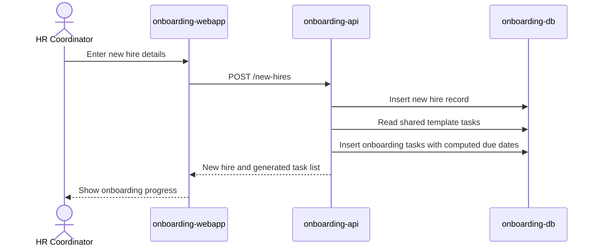

# Add New Hire and Generate Checklist

An HR Coordinator adds a new hire and the onboarding checklist is generated
automatically from the shared template, ready for HR, IT, and Facilities to
work from.

