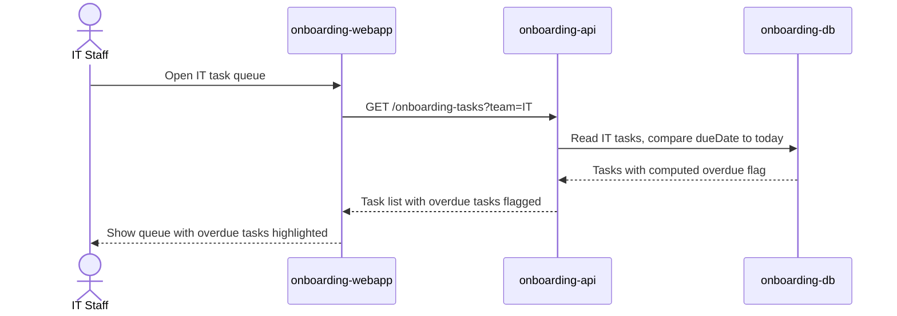

# Overdue Task Reminder

Each team lead checks in and sees which of their own onboarding tasks have
gone overdue, flagged automatically by the system.

```mermaid
sequenceDiagram
    actor ITStaff as IT Staff
    participant onboarding-webapp
    participant onboarding-api
    participant onboarding-db

    ITStaff->>onboarding-webapp: Open IT task queue
    onboarding-webapp->>onboarding-api: GET /onboarding-tasks?team=IT
    onboarding-api->>onboarding-db: Read IT tasks, compare dueDate to today
    onboarding-db-->>onboarding-api: Tasks with computed overdue flag
    onboarding-api-->>onboarding-webapp: Task list with overdue tasks flagged
    onboarding-webapp-->>ITStaff: Show queue with overdue tasks highlighted
```

